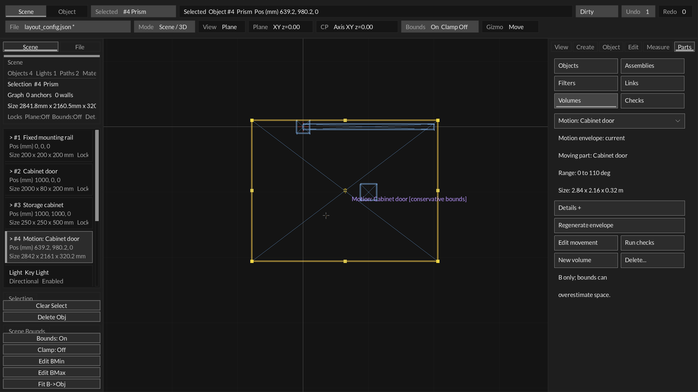
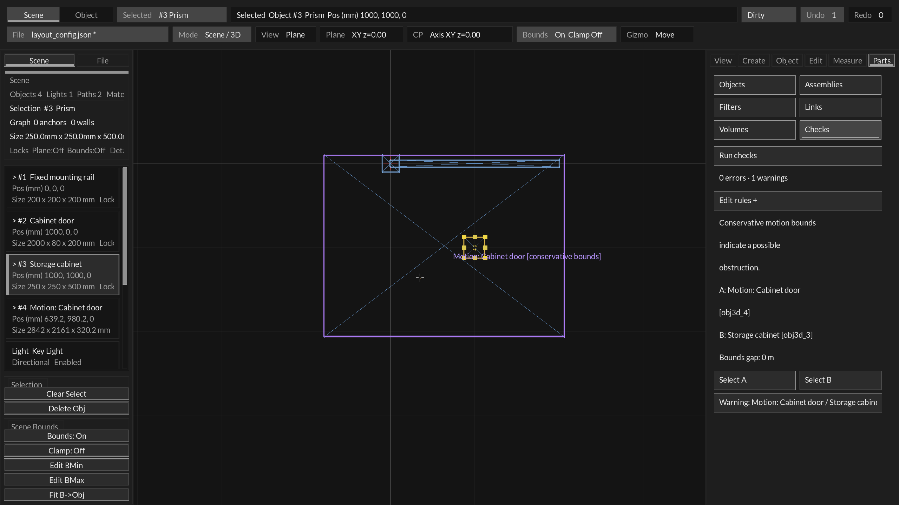

# Motion envelopes — S4 opening slice

Status: saved single-object Travel/Hinge envelopes implemented. This is the first
S4 slice, not a general joint, assembly animation or exact swept-solid solver.

## Mouse workflow

1. In **Measure**, choose or create a saved **Travel** or **Hinge** rule. Apply any
   staged Min/Max/Position edits first.
2. Click **Create envelope** below the movement slider and Min/Max/Reset controls.
   The editor opens **Parts → Volumes** and selects the generated wire box.
3. The pane shows **current / STALE**, the moving part, the saved range and the
   box size. **Details** reveals the movement ID, pose count and padding.
4. Click **Run checks** to open **Parts → Checks**. Select a named result, then
   **Select A / Select B** to locate the envelope or obstruction.
5. Use **Edit movement** to return to Measure with the moving B object selected.
   The existing slider, Min/Max/Reset and numeric Position control inspect motion.
6. After changing the range, driver/reference geometry or B dimensions, click
   **Regenerate envelope**. It retains the envelope's entity ID. Measure displays
   **Update envelope** for a stale saved envelope and **View envelope** otherwise.
7. **New volume** still opens the ordinary Keep-out/Service form. Envelope
   dimensions are derived, so its pane does not expose manual size/owner fields.
   **Delete…** requires a visible confirmation; deletion participates in undo.

Creation samples the **saved** movement, never unsaved form text. Sampling does
not move the live document, add pose objects, or change the current Position.
The envelope is a persistent world-aligned prism labeled `Motion: <B name>` and
semantically typed `MotionEnvelope`. Its normal wire color is purple; existing
selection/hover colors still apply. Viewport labels explicitly say
`conservative bounds` or `STALE - regenerate`, and obey visibility/filter/clipping.

## Physical coverage and scope

The UI uses 33 evenly spaced poses, including both limits. Generation samples the
existing solver in an isolated object-store copy, so saved pivot offsets, world
axes, locks and constraint behavior are shared with the movement controls.

A world AABB encloses all sampled corners. Linear translation covers intermediate
poses through the union bounds of the endpoint poses. For a hinge, padding on every
box axis is at least `r * deltaAngle / 2`, with deltaAngle in radians and r the
largest sampled corner-to-pivot radius. Every pose is within half a sample interval
of a sample; arc length bounds the intervening displacement. Additional padding
covers physical/numerical tolerance and float geometry storage. A panel receives
positive box thickness, respecting the existing primitive minimum.

These boxes intentionally overestimate the occupied region, especially for doors.
Automatic obstruction checks produce **warnings**, `approximate=true`, and a
possible-obstruction message. Box overlap does not prove a physical collision.
Explicit no-intersection/clearance rules involving an envelope also report bounds
results as warnings; a clear bounds gap satisfies the conservative check only.

Automatic envelope checks exempt the moving B owner and fixed A reference/mounting
object, other reserved volumes and Reference geometry. Hidden design parts still
participate. Explicit rules can check the exempt entities if desired.

Scope is one moving **B primitive** (rectangular prism or panel) under one saved
Travel/Hinge rule, with other rule targets fixed during sampling. Downstream
followers and assembly members are **not** included in the envelope. No imported
mesh motion, simultaneous independent joints, pose animation, exact swept union,
penetration depth, routing or structural acceptance is provided here.

## Freshness and transactions

Stored input fingerprints cover movement references/offsets, axis, range/home,
captured rigid basis, resolved A driver point/direction, B primitive dimensions and
physical world scale. Current target/B pose is excluded so ordinary travel within
the same range does not stale the envelope. A separate bounds fingerprint detects
manual movement, resizing or rotation of the derived box. Label/filter/selection
changes alone do not change geometric freshness.

A stale envelope remains visible but is excluded from automatic obstruction
calculations, replaced by a structured unresolved warning. Explicit rules using it
also return unresolved warnings. Checks never silently interpret its old box as a
current pass. Check-result freshness includes rule and envelope provenance changes.

Generation/regeneration is one candidate transaction and one undo step; failure
preserves objects, IDs, motion Position and provenance. A current regeneration with
the same sample count is a no-op. Sampling/box creation can fail on locks, numeric
precision, constraint conflicts or scene bounds; no partial envelope is published.
The source movement cannot be removed/retyped while an envelope references it.
Generic object deletion directs the user to Volumes, where the atomic command
removes both geometry and provenance. Existing incident links/checks must still be
removed before deleting an envelope.

## Saved document and agent boundary

Schema **18** adds `engineering.motionEnvelopes`, with up to 32 records:

- `objectId`: existing stable numeric object handle; its persistent entity ID is
  still the normal scene reference identity.
- `ruleId`, `samples` (2–129), `paddingMeters`.
- `inputDigest`, `boundsDigest`: 16 lowercase hexadecimal characters each.

Schemas 0–17 migrate with no derived records. Schema 18 requires the array;
malformed IDs, endpoints, duplicates, sample counts, padding or digests reject the
load atomically. Downgrading a nonempty array to an older schema is rejected.
Stale records are valid saved state and remain explicitly unresolved after reopen.
Reserved geometry and provenance survive the authoritative layout snapshot in
scene export/compiler extensions; envelopes are excluded from physical solids and
camera framing just like other reserved volumes.

Public C operations are in `Layout/layout_motion.h`:
`Layout_SampleMotion` is read-only, `Layout_GenerateMotionEnvelope` accepts an undo
hook, and `Layout_MotionEnvelopeCurrent` reports freshness. Existing
`agent_scene_tool --check-layout` reports envelope warnings through the structured
spatial report. No live MCP mutation transport is introduced.

## Evidence and next boundary

Regression coverage includes current-pose-clear/travel-range-obstructed geometry,
read-only sampling, history failure, undo/redo identity, target-independent
freshness, dense hinge intermediate-pose containment with both 2 and 33 samples,
physical world scale/panels, locked failures, moved drivers, stale range/bounds,
regeneration, deletion guards, schema 17 migration, eight malformed schema 18
loads, export retention and exclusion, and mouse create/check/edit/regenerate/delete.
Source-run native fixtures cover Measure, Volumes, potential obstructions and stale
feedback for hinges, plus travel obstruction results. User hands-on acceptance
remains separate from these tests and captures.

Next is S4 refinement: an explicit moving set/assembly scope and pose inspection
from an obstruction result, with coverage/error bounds retained. Tightening
conservative bounds can reduce false positives after this opening workflow is
accepted. Broader routing and compiler topology bridges remain later phases.
