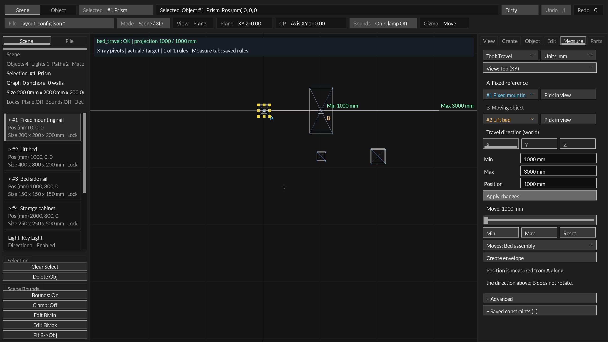
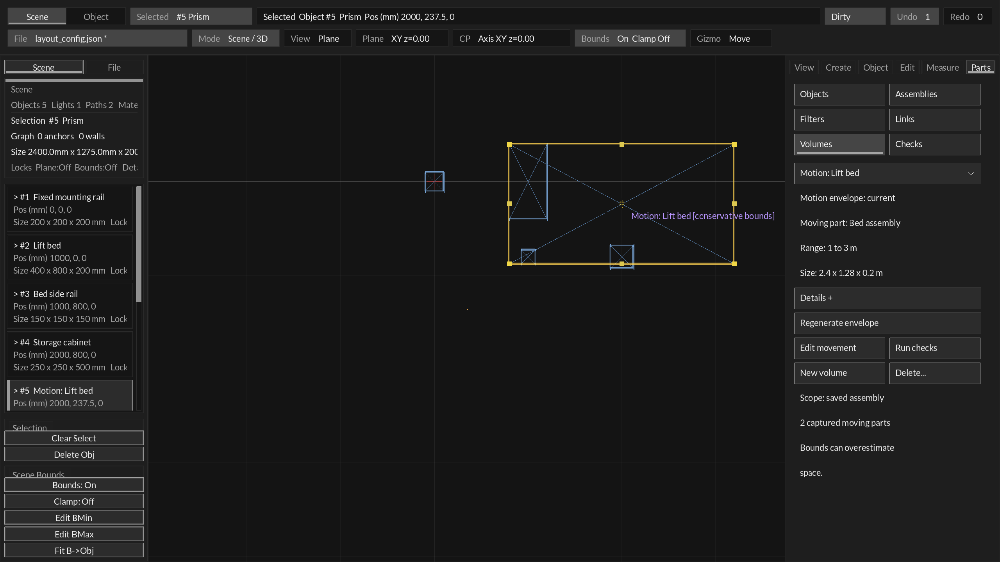
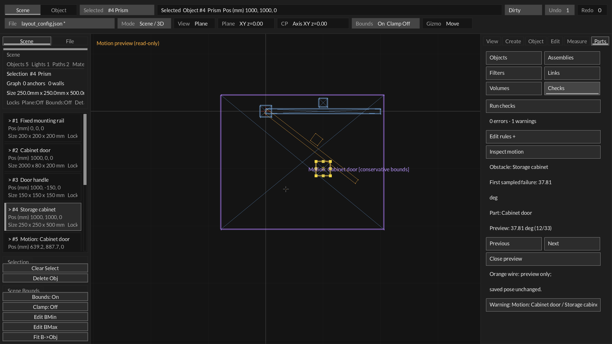
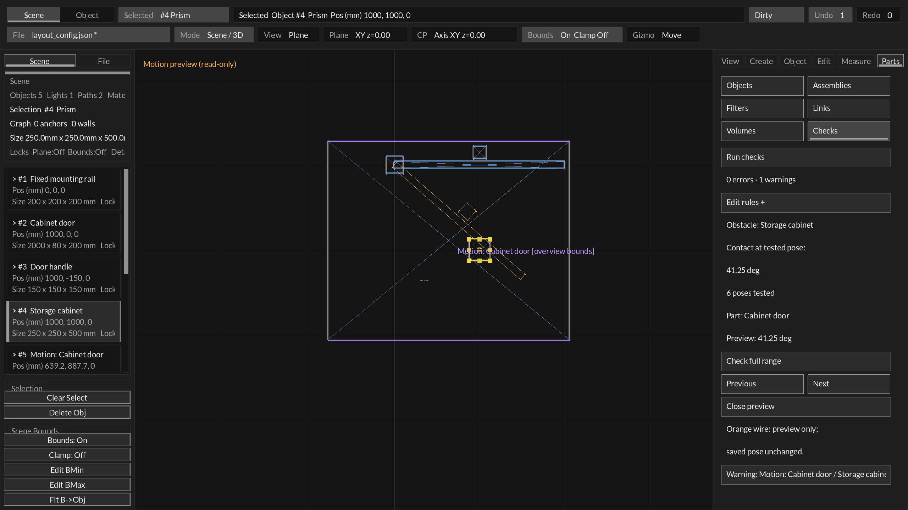
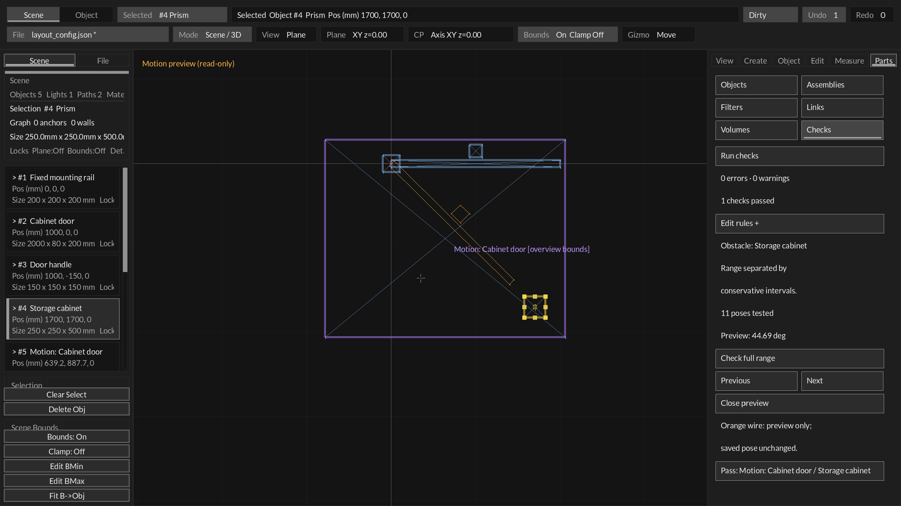
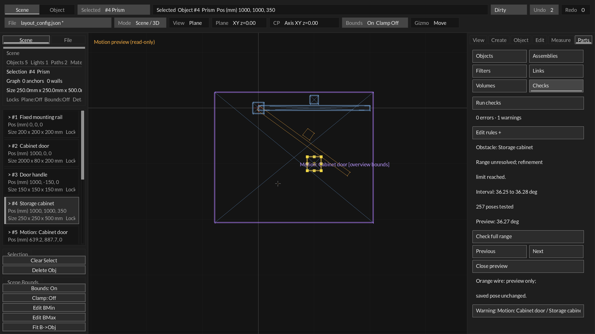
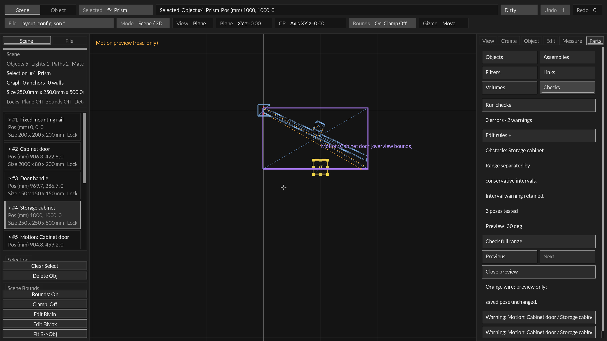

# Motion envelopes and pose inspection — S4

Status: saved Travel/Hinge envelopes cover B alone or an explicit rigid assembly.
Checks use conservative member intervals and can inspect sampled/refined poses
in a read-only native preview, with bounded full-range separation analysis.
Independent joints and exact swept-solid collision remain outside this contract.

## Mouse workflow

1. In **Measure**, choose or create a saved **Travel** or **Hinge** rule. Apply any
   staged Min/Max/Position edits first.
2. Use **Moves** below Min/Max/Reset to choose **B only** or a containing assembly.
   Scope is saved immediately in one undoable command. The slider and numeric
   Position then move the selected group, including nested assembly frames.
3. Click **Create envelope** below the movement slider and Min/Max/Reset controls.
   The editor opens **Parts → Volumes** and selects the generated wire box.
4. The pane shows **current / STALE**, the moving part, the saved range and the
   box size. The box is labeled **overview bounds**; checks use member intervals.
   **Details** reveals the movement ID, pose count and padding.
5. Click **Run checks** to open **Parts → Checks**. Select a named result, then
   **Select A / Select B** to locate the envelope or obstruction.
6. Use **Edit movement** to return to Measure with the moving B object selected.
   The existing slider, Min/Max/Reset and numeric Position control inspect motion.
7. After changing the range, driver/reference geometry, scope or member geometry, click
   **Regenerate envelope**. It retains the envelope's entity ID. Measure displays
   **Update envelope** for a stale saved envelope and **View envelope** otherwise.
8. **New volume** still opens the ordinary Keep-out/Service form. Envelope
   dimensions are derived, so its pane does not expose manual size/owner fields.
   **Delete…** requires a visible confirmation; deletion participates in undo.

Creation samples the **saved** movement, never unsaved form text. Sampling does
not move the live document, add pose objects, or change the current Position.
The envelope is a persistent world-aligned prism labeled `Motion: <B name>` and
semantically typed `MotionEnvelope`. Its normal wire color is purple; existing
selection/hover colors still apply. Viewport labels explicitly say
`overview bounds` or `STALE - regenerate`, and obey visibility/filter/clipping.

## Physical coverage and scope

The UI uses 33 evenly spaced poses, including both limits. Generation samples the
existing solver in an isolated object-store copy, so saved pivot offsets, world
axes, locks and constraint behavior are shared with the movement controls.

A world AABB encloses all sampled corners. Linear translation covers intermediate
poses through the union bounds of the endpoint poses. For a hinge, padding on every
box axis is at least `r * deltaAngle / 2`, with deltaAngle in radians and r the
largest sampled corner-to-pivot radius. Every pose is within half a sample interval
of a sample; arc length bounds the intervening displacement. Additional padding
covers physical/numerical tolerance and float geometry storage. A panel receives
positive box thickness, respecting the existing primitive minimum.

The saved overview box intentionally overestimates occupied space. It remains
useful for visibility, provenance and consumers of the reserved-volume snapshot.
Checks now build a transient union of **one physical box per member per interval**.
For 33 poses this means 32 intervals per member. A solved midpoint's corners are
expanded by half-interval translation in each axis, or by `r * halfAngle` for a
hinge, plus a numerical guard (`10 µm + 64*FLT_EPSILON*max(1, magnitude+radius+arc)`).
Each interval box covers the intervening rigid movement, including unsampled poses.
Member/interval gaps stay distinct rather than being filled by the overview box.
Coverage is built once per envelope per check run and reused across targets.

A possible overlap remains a **warning**, `approximate=true`; box overlap does not
prove collision. An explicitly saved check can return **Pass** when these
conservative intervals are separated or satisfy clearance throughout the range.
Automatic checks omit clear pairs. `distanceMeters` for this method is a
conservative **lower bound**, not the exact minimum distance during movement.
The UI calls it Interval bounds gap; JSON adds
`geometryMethod="motion_member_intervals"` to distinguish it from primitive or
other bounds results. No saved schema/version changes are needed for transient
coverage. Stale/unavailable coverage remains an unresolved warning.

Targets are evaluated at their current static authored geometry. A downstream
follower driven by B/the moving group is refused as a static target. Two motion
envelopes retain the older coarse approximate comparison; coupled motion is not
solved. Mesh targets retain conservative proxy geometry; full-range primitive
inspection remains unavailable for them.

Automatic envelope checks exempt the complete saved moving group and fixed A
reference/mounting object, other reserved volumes and Reference geometry. Hidden design parts still
participate. Explicit rules can check the exempt entities if desired.

## Explicit assembly scope

The default remains B only; parenting alone never changes a movement's scope.
A saved Travel/Hinge may explicitly select a containing assembly. That assembly
and all nested members receive the rigid delta solved for B. Their existing IDs,
relative arrangement and assembly frames are retained. The same path serves
slider/numeric movement, accepted direct B edits and isolated envelope sampling.

This bounded slice supports at most 64 design panels/prisms per moving assembly.
A must remain outside the group. Reference/reserved/mesh members and other
geometric constraints mentioning any group member are refused explicitly. This
prevents an independent rule from distorting a rigid group. Locks, construction
plane/bounds conflicts and history failures roll back the entire command. Member
placement can still be edited independently to change the group's arrangement;
that stales the envelope. Reparenting B out of its saved scope is refused until
scope changes; adding/removing/reparenting other members stales coverage.

Scope does not infer attachment links or electrical relationships. Downstream
followers in the original B-only constraint forest remain outside its envelope.
No imported-mesh motion, independent simultaneous joints, pose animation, exact
swept union, penetration depth or structural acceptance is provided here.

## Inspect an obstruction without moving the scene

In Parts → Checks, select a current envelope result and click **Inspect motion**.
For a primitive obstacle this tests the saved sample positions against oriented
primitive geometry, including a saved rule's requested clearance. It opens at the
first sampled failure, or the closest sampled pose when no sample fails.

The focused form names the obstacle, first failure position/member when found,
and the current preview position. **Previous / Next** step through sampled poses;
**Close preview** restores result details. Orange wires and an explicit read-only
viewport label distinguish the preview from the authored objects. The source pose,
movement target, scene file and undo count are unchanged. New checks, selecting a
different result or authored-input drift clear the preview; other tabs hide it.
Visibility and viewport clipping apply to the cached ghost geometry.

A result with no sampled failure alone does not certify clearance. Click
**Check full range** to run bounded adaptive analysis against this static target:

- **Range separated by conservative intervals**: every interval was separated
  using conservative geometry/displacement bounds, including the requested clearance.
- **Contact at tested pose / Clearance fails at**: a tested endpoint or refined
  midpoint violates the check. The orange preview jumps to that actual tested pose.
  It does not claim the earliest collision time.
- **Range unresolved**: some intervals remain ambiguous after a refinement limit.
  The pane shows one unresolved interval and its midpoint preview. It never becomes
  a pass simply because samples missed contact.

The analysis uses the stronger of the member interval-box gap and the oriented
midpoint primitive gap minus its maximum point-displacement allowance. Distance
to a static set is 1-Lipschitz under this rigid displacement, so a positive lower
bound applies between samples. The allowance includes a numerical guard. Ambiguous
intervals bisect deterministically, to depth 12, with 257 tested poses in the UI
(including endpoints). Search continues past ambiguous intervals while budget
remains so a later tested violation can still be found. The C API accepts budgets
1–4097. Unresolved results keep a zero lower bound; a separated result's gap is a
conservative lower bound over all completed intervals.

The original interval warning remains a separate result after inspection; when
range analysis separates it, the pane states that the interval warning is retained.
Previous/Next return to regular saved sample positions from a refined position.
Close restores result details. Stale envelopes, meshes, coupled/downstream moving
targets, or sampled lock/bounds/solver failures receive an unavailable message.
This checks clearance of the prescribed rigid geometry against one static target;
it does not establish continuous lock/bounds feasibility, manufacturing precision,
independent-joint motion or physical build acceptance.

## Freshness and transactions

Stored input fingerprints cover movement references/offsets, axis, range/home,
captured rigid basis, resolved A driver point/direction, B primitive dimensions and
physical world scale. Current target/B pose is excluded so ordinary travel within
the same range does not stale the envelope. A separate bounds fingerprint detects
manual movement, resizing or rotation of the derived box. Label/filter/selection
changes alone do not change geometric freshness. Assembly records additionally
capture member IDs, physical sizes and frames relative to B. Membership, shape or
relative-pose changes stale coverage; normal rigid movement does not. Relative
frame comparisons allow the existing float geometry tolerance (10 micrometers
plus a coordinate-magnitude float guard; orientation tolerance 1e-5).

A stale envelope remains visible but is excluded from automatic obstruction
calculations, replaced by a structured unresolved warning. Explicit rules using it
also return unresolved warnings. Checks never silently interpret its old box as a
current pass. Check-result freshness includes rule and envelope provenance changes.

Generation/regeneration is one candidate transaction and one undo step; failure
preserves objects, IDs, motion Position and provenance. A current regeneration with
the same sample count is a no-op. Sampling/box creation can fail on locks, numeric
precision, constraint conflicts or scene bounds; no partial envelope is published.
The source movement cannot be removed/retyped while an envelope references it.
Generic object deletion directs the user to Volumes, where the atomic command
removes both geometry and provenance. Existing incident links/checks must still be
removed before deleting an envelope.

## Saved document and agent boundary

Schema **18** introduced `engineering.motionEnvelopes`, with up to 32 records:

- `objectId`: existing stable numeric object handle; its persistent entity ID is
  still the normal scene reference identity.
- `ruleId`, `samples` (2–129), `paddingMeters`.
- `inputDigest`, `boundsDigest`: 16 lowercase hexadecimal characters each.

Schema **19** adds `motionAssembly` to Travel/Hinge constraints (empty means B
only), and `assemblyId` plus `members` to each envelope. Member snapshots carry
`entityId`, primitive `kind`, `sizeMeters`, `localOriginMeters` and `localBasis`
relative to B. Existing schema 18 envelopes migrate as B-only and retain freshness.
Schema 19 requires these fields. Malformed scopes, excessive/duplicate members,
invalid physical sizes or nonrigid/left-handed frames reject the load atomically.
Older schema declarations cannot carry nonempty assembly motion data.

Schemas 0–17 migrate with no derived records. Schema 18+ requires the array;
malformed IDs, endpoints, duplicates, sample counts, padding or digests reject the
load atomically. Declaring a nonempty envelope array below schema 18 is rejected.
Stale records are valid saved state and remain explicitly unresolved after reopen.
Reserved geometry and provenance survive the authoritative layout snapshot in
scene export/compiler extensions; envelopes are excluded from physical solids and
camera framing just like other reserved volumes.

Public C operations are in `Layout/layout_motion.h`:
`Layout_SampleMotion` is read-only, `Layout_GenerateMotionEnvelope` accepts an undo
hook, and `Layout_MotionEnvelopeCurrent` reports freshness.
`Layout_SampleMotionSet` samples the explicit group;
`Layout_InspectMotionObstruction` returns first failing/closest sample position,
member ID, gap, hit flag and sample count, without scene writes.
`Layout_BuildMotionCoverage` returns an owned transient union (empty output required;
release it with `Layout_FreeMotionCoverage`), and `Layout_MotionCoverageDistance`
queries it against the same unchanged layout. `Layout_CheckMotionRange` returns
separated/tested-failure/unresolved status, pose count, tested position/member,
unresolved interval and conservative gap. It leaves output untouched on unavailable
input. Existing `agent_scene_tool --check-layout` reports interval results through the structured
spatial report. No live MCP mutation transport is introduced.

## Evidence and next boundary

Regression coverage includes current-pose-clear/travel-range-obstructed geometry,
read-only sampling, history failure, undo/redo identity, target-independent
freshness, dense hinge intermediate-pose containment with both 2 and 33 samples,
physical world scale/panels, locked failures, moved drivers, stale range/bounds,
regeneration, deletion guards, schema 17 migration, eight malformed schema 18
loads, export retention and exclusion, and mouse create/check/edit/regenerate/delete.
Continuation tests add nested travel/hinge rigidity, dense group coverage, scaled
units, scope upgrade/downgrade preserving envelope identity, member changes,
lock/bounds/history rollback, malformed schema 19 and schema 18 migration, group
provenance through runtime compilation, sampled hit/clearance/false-positive cases
and mouse scope/preview/next/close/stale handling.
Source-run native fixtures cover Measure, Volumes, potential obstructions and stale
feedback for hinges, plus travel obstruction results. User hands-on acceptance
remains separate from these tests and captures.

The interval continuation adds dense group coverage for Z/Y hinges, scaled oblique
panel travel, empty assembly-gap and hinge-corner false-positive reduction, report
method/pass readback, thin between-sample contact, endpoint contact, clearance,
budget/depth limits, downstream follower refusal, locked/stale unavailable results
and mouse full-range/refined-position navigation with unchanged scene/history.
Native range fixtures assert their expected status before rendering; a known door
contact exposed premature unresolved handling and is covered by a regression.

Next is a bounded van-oriented workflow audit using named bed/door assemblies,
service spaces and motion checks, with illustrative dimensions explicitly labeled.
Use that evidence to choose any remaining UI/coverage refinements before S5 routing
corridors and cable paths. Independent constrained followers, arbitrary moving
sets, imported meshes and multiple joints need separate contracts. Compiler
hardware/software topology bridges remain later phases.
