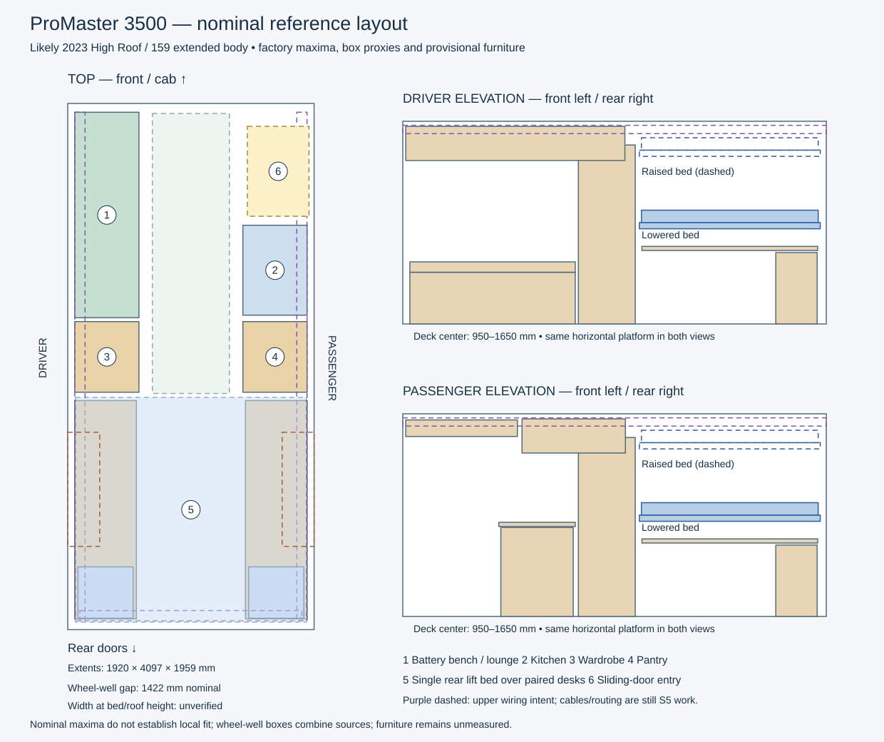

# ProMaster 3500 extended High Roof: first dimensional basis

Researched 2026-10-04. Working configuration: **likely model year 2023, 3500 cargo
van, 159-inch wheelbase, extended body, regular High Roof (H2)**. The user has
confirmed High Roof; model year remains provisional. Extended body does not add
wheelbase: it adds length behind the rear axle. Super High Roof is a different
configuration and is excluded here.

This is a published nominal reference for layout development. It is not a
measurement of the user's vehicle, an OEM surface model, or a fabrication drawing.

## Source hierarchy

1. [Ram's 2023 Commercial specifications, page 51](https://xr793.com/wp-content/uploads/2023/04/2023-Ram-Commercial-Specs.pdf).
   Ram-authored publication hosted by an archive. The actual table was rendered
   and visually checked at the **3500 cargo / 159 WB extended / High Roof** column,
   distinct from the neighboring Super High Roof and windowed van columns.
2. [Ram Body Builder: ProMaster Views & Charts, dated 2020-06-12, page 2](https://www.ramtrucks.com/BodyBuilder/service/Image?imageId=MtQrP%2FFqLY5r%2Fest8MtGjGgHzAHGUTU0WB3rWuqSY7YmQ2vEhuBWBG%2BtayvEWWPb%0A).
   L5H2 / VF3L17–VF3L27 column provides native millimeters and named measurement
   datums. Matching 2023 brochure inch entries corroborate the main dimensions;
   the older chart alone supplies beltline and cargo-body length values below.
3. [Upfit Supply extended-body guide](https://upfitsupply.com/blogs/measurement-guides/ram-promaster-159-ext-wb-interior-cargo-measurements)
   and its [2024 drawing](https://upfitsupply.com/wp-content/uploads/Measurements-RAM-ProMaster-159-Ext-2024.pdf).
   This is the upfitter's own reference drawing, visually checked. The page lists
   applicability including 2023 3500 extended vans. Its usable-space measurements
   differ from factory maxima; measurement tolerances and exact datums are not
   documented. Keep these values separately labeled rather than averaging them.

The machine-readable [dimension basis](../config/concepts/promaster_2023_dimension_basis.json)
records source URLs, document dates, page/column, published units, meter values,
qualification notes, and hashes of the downloaded 2023 brochure and upfit drawing.
Source PDFs were inspected in temporary storage, not redistributed in this repo.

## Published nominal dimensions

Millimeters below come directly from the body-builder metric column, rather than
being recalculated from rounded brochure inches. The 2023 brochure confirms the
matching inch entries except the three rows explicitly marked as older-chart only.

| Dimension / datum | mm | Published inches | Interpretation |
|---|---:|---:|---|
| Wheelbase, L101 | 4039 | 159.0 | Older chart metric; 2023 configuration says 159 WB |
| Exterior body length, L103 | 6364 | 250.6 | Whole vehicle |
| Exterior maximum height, H101 | 2603 | 102.5 | Whole vehicle, not headroom |
| Exterior maximum width, W103 | 2066 | 81.3 | Without mirrors |
| Cargo floor length, L202-1 | 4097 | 161.3 | Behind front row, at floor |
| Cargo-body overall length, L507 | 4070 | 160.2 | Different datum; older chart only |
| Cargo beltline length, L204-1 | 3889 | 153.1 | Behind front row; older chart only |
| Cargo width at floor, W500 | 1920 | 75.6 | Maximum floor width |
| Width between wheel wells, W201 | 1422 | 56.0 | Floor clearance between wheel houses |
| Maximum cargo height, H505 | 1959 | 77.1 | Untrimmed maximum |
| Side opening width × height, L508/H508 | 1250 × 1755 | 49.2 × 69.1 | Opening dimensions |
| Lower rear opening width × height, W207/H202 | 1610 × 1790 | 63.4 × 70.5 | Opening dimensions |

The AI concepts' roughly 13 ft 4 in / 76 in annotations are useful visual intent,
but the nominal model now uses the factory dimensions above.

## What the upfit drawing adds

Its wheel-well callouts are **35 in longitudinal × 17 in high × 9 in deep**,
with **25.5 in from its rear datum to the trailing wheel-well edge**. Its floor
outline is 156 in long × 74 in wide, side opening 48.5 in, and rear opening 61 in.
These are narrower/shorter usable-space references than the factory maximum
measurements. Driver shelving span is 147 in and passenger span is 101 in;
neither is the factory floor length.

In the new scene, wheel-well length and height use those callouts provisionally.
The 25.5-inch rear offset assumes the guide's rear datum matches the modeled
factory floor rear; that alignment still needs measurement. Cross-van placement
uses the factory 1422 mm gap, with a box depth derived as
`(1920 - 1422) / 2 = 249 mm`. This differs from the upfitter's 9-inch depth because
the floor-width datums differ. It is explicitly a mixed-source **box proxy**, not
an exact wheel-house contour.

## Separate editable scene

- Authored input: [van_layout_promaster_2023_nominal_v1.json](../config/concepts/van_layout_promaster_2023_nominal_v1.json).
- Native document: [van_layout_promaster_2023_nominal_v1.layout.json](../config/examples/van_layout_promaster_2023_nominal_v1.layout.json).
- [Review diagram](assets/van-promaster-2023-nominal-v1.svg), generated from the new authored input.



The earlier concept and the user's private working files are preserved. This
variant uses a distinct scene ID and filename. Entity IDs are preserved for the
existing parts so their bed motion, relationships and saved checks remain valid.

The floor reference is now **1920 × 4097 mm**, and the maximum height reference
is **1959 mm**. The frame remains right-handed: +X passenger, +Y front, +Z up;
Z=0 is nominal bare cargo floor, centered on the modeled maximum floor outline.
A future finished floor needs a separate thickness/offset, not silent rescaling.

The wall and cab-boundary primitives are box proxies at those maxima. They do
not represent taper, roof curvature, ribs, seats, or the door's true position.
A hidden beltline-front marker distinguishes the 3889 mm length from the floor
length, assuming a common rear datum. Its display height and width are arbitrary;
it must not be mistaken for an OEM cross-section.

Side-opening header geometry now reflects a 1250 × 1755 mm opening. Two hidden
size markers record side and rear openings independently. Side-door longitudinal
placement and opening bottom alignment to Z=0 remain assumptions. These markers
are references, not reserved-volume rules or solids filling the openings.

The battery bench remains on the driver side opposite the sliding door. Kitchen
and entry remain passenger-side. The single rear bed stays horizontal above the
paired desks, with deck-center travel **950–1650 mm**. Upper wiring corridors
remain intent geometry for S5; no cable route is inferred from these sources.

Furniture, mounting guides, appliances, material thicknesses and service volumes
retain their previous concept dimensions and positions. In particular, the
1800 mm bed width is **not verified against wall widths at sleeping/stowed heights**.
The shallow cabinet above the side door also needs revision against the actual
threshold/header and trim geometry before its clearance can be trusted.

## What is verified, and what is not

The native candidate loads, regenerates its conservative bed envelope, reloads,
exercises min/max bed travel, and exports authoring/runtime documents through the
existing scene compiler. The existing twelve saved bed-obstruction checks pass
against the existing concept targets. This does **not** validate the whole build,
fit inside OEM contours, attachment loads, or finished-space clearances.

The smoke test verifies both scene profiles generate deterministically, the old
native fixture stays byte-identical, new factory floor/opening values and the
1422 mm wheel-well gap survive native serialization, concept furniture does not
silently change, source-status metadata survives, and outputs cannot overwrite
an existing edit directory. Scene IDs are validated as identifiers, not paths.

```sh
make van_concept_tool van-concept-smoke agent-scene-smoke
python3 tools/build_van_concept.py \
  --request config/concepts/van_layout_promaster_2023_nominal_v1.json \
  --out tmp/van_promaster_2023_new_review
```

Use a new output directory each time. The offline native finalizer accepts an
optional `--profile <scene_id> <dimensions_status>` before check targets; old
invocations retain their original default profile. No editor feature, native
schema, shared API, or Desktop package was changed for this research/model pass.
Existing core units, native motion/spatial APIs and `core_scene_compile` are reused.

## Remaining geometry needed before layout becomes dimensionally dependable

1. Confirm VIN/model year and body configuration. The selected profile is likely
   2023, not a confirmed vehicle identity.
2. Establish a rear-threshold origin and record floor/seatback datums. Measure
   side opening position and its bottom height relative to the cargo floor.
3. Measure clear width at floor, desk, lowered bed, raised bed and upper chase
   heights, at several front-to-rear stations. Maximum floor width is insufficient.
4. Measure minimum roof/rib clearance, wheel-well contour and actual rear offset,
   structural rib locations and mounting holes. Record which values are measured
   and which remain interpolated.
5. Add the chosen subfloor, insulation, furring and wall/ceiling panels, then check
   bed width/travel and cabinet clearances in the finished interior.

The older factory table labels W200 1714 mm as maximum cargo width while W500
states 1920 mm at floor. Without a trustworthy sectional datum, W200 is retained
as an unresolved conflict and is not adopted as universal wall width. Likewise,
3889 mm beltline length is not promoted to a guaranteed clear box at all heights.

Ram's public [CAD instructions](https://www.ramtrucks.com/BodyBuilder/service/Image?imageId=MtQrP%2FFqLY5r%2Fest8MtGjGgHzAHGUTU0WB3rWuqSY7YmQ2vEhuBWBMSuVJHjy3PH%0A)
describe a controlled commercial-upfitter request with an NDA and a limited model
year window. The inspected document is dated 2020; the current bulletin still
points to that route. This research did not obtain a public downloadable 2023
interior CAD model or exact rib/hole coordinates. No request was submitted.

S5 can proceed against clearly labeled provisional corridors: define route/path
entities, endpoints, manual UI editing and length reporting first, then add
corridor association and obstruction checks. Correcting the vehicle contour and
finished dimensions will remain a separate measurable task, allowing routes to
be revised without changing entity identity or replacing the scene architecture.
