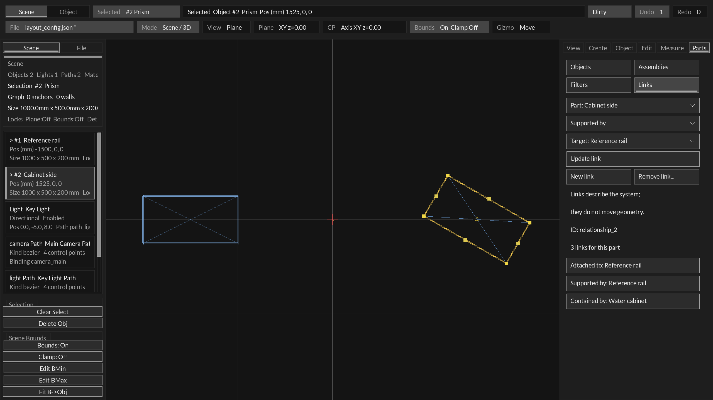

# Explicit relationships (S3a)

Status: directed attachment, support and containment links implemented.
Date: 2026-09-29. Current layout schema: **16**. Program VERSION remains 0.4.0.

## Using Links

Open **Object → Connections** using the selector below the Object tab.
This form contains three selectors and
explicit Create/Update/New/Remove actions; it requires no new shortcuts.

1. Choose **Part** (the source). Objects and assemblies are both available,
   including objects hidden by the current view filter. Opening Links initially
   uses the selected part/assembly when available. Choosing a source object also
   selects it in the viewport; choosing an assembly clears individual selection.
2. Choose **Attached to**, **Supported by** or **Contained by**.
3. Choose **Target**. Read the form top to bottom: the Part is supported by the
   Target, for example. Then press **Create link**. Selecting a saved link changes
   that action to **Update link**, which preserves its stable relationship ID.
4. Saved links for the source are buttons below the form. Outgoing rows say
   `Supported by: rail`; incoming rows on the rail say `Supports: cabinet`.
   Incoming attachment says `Attached from`, and incoming containment says
   `Contains`. Clicking a row loads its original directed source/type/target.
5. Use **New link** to clear the saved-link selection while retaining the source.
   **Remove link...** requires **Confirm remove link** or **Cancel**.

Endpoint choices include IDs alongside names so identically named entities remain
selectable. The relationship ID is shown when a saved link is selected. Edits are
staged in the form until Create/Update; the selectors and New link do not modify
saved geometry or history. Undo/redo/reopen refresh a selected saved link from the
document; if it has disappeared the form returns to a new-link state.



[Endpoint selector capture](assets/s3-choices.png) shows both objects and assemblies.
These native rendered captures use disposable geometry and illustrate the controls;
they are not proof of physical attachment, measured van fit or structural safety.

## Meaning and invariants

A relationship is a directed record containing a stable ID, source ID, target ID
and one of `attached_to`, `supported_by`, `contained_by`. Source and target are live
geometry entities or assemblies. Multiple types may connect the same pair;
multiple support or container targets are permitted. An exact same directed
source/type/target duplicate is refused. Self-links, unknown types, missing endpoints,
duplicate IDs and containment cycles are refused atomically. Attachment and support
cycles are allowed because this is a semantic graph, not the acyclic driving-rule
solver. A later structural validator can assess support semantics separately.

Relationships and assembly parenting are distinct. A `contained_by` link does not
set Parent, and Parent does not implicitly create a containment link. Attachment,
support and containment links do not snap, move or rotate geometry. Moving an
assembly uses its transform children only; linked entities outside that hierarchy
do not follow. Names and parent paths may change without invalidating links.

Deleting or replacing a linked object, or deleting an empty but linked assembly,
is refused until its incident links are removed. The UI reports how to remove
those links. This avoids silently destroying system references. Removing a link
is a separate reversible history step; undo restores its ID and endpoints.
Whole-store ObjectAuthoring replacement and mesh-asset save also retain their
engineering-data guards, now explicitly including links in their diagnostics.

## Persistence, transactions and export

Schema 16 extends the required `engineering` block with:

```json
{
  "nextRelationshipId": 2,
  "relationships": [
    {
      "id": "relationship_1",
      "source": "water_controller",
      "target": "water_cabinet",
      "type": "contained_by"
    }
  ]
}
```

All existing schema-15 semantic records and assembly frames remain. Schemas 0–15
load with an empty relationship graph; schema-15 names, properties and assemblies
are preserved. Missing/malformed schema-16 graph fields and nonempty graphs
mislabeled as an older schema are refused before replacing the live document.
Empty forward-written graph fields on an old-schema document remain readable.
New relationship IDs use a retained monotonic sequence and skip existing IDs.
The initial bound is **128 links**, with 63-byte IDs/endpoints. Relation IDs have
letters, digits, underscore, dot or hyphen and live in a separate edge namespace.

`Layout_EditRelationship` uses the existing candidate/validate/history/publish
transaction. Editor Create/update/remove operations reserve undo before publishing. Rejected edits
and reservation failures leave geometry, metadata, counters, links and undo count
unchanged. Reapplying an identical saved edge is a successful no-op with no new
history step. Existing S1 driving constraints continue to validate normally.

`Layout_FindRelationship` returns a borrowed record. `Layout_QueryRelationships`
returns matching IDs, supports all/specific type plus outgoing/incoming/either
endpoint, and reports the full match count even when an output buffer is smaller.
These C APIs support deterministic graph inspection/editing; this slice adds no
new MCP transport. `Layout_ValidateRelationships` returns a clear first-failure
message. A general multi-category structured design validator remains subsequent
work; this validator does not check physical containment or support capacity.

Canonical exported object `extensions.engineering.relationships` contains its
incident edges, preserving their directed endpoints. The complete graph, including
assembly-only edges, remains in `extensions.line_drawing.layout_snapshot`.
Authoring-to-runtime compilation preserves both. Transient filters do not drop
links or endpoints from export. No shared renderer hierarchy/schema was replaced.

## Proof and next boundary

457 host tests / 45 reported suites pass, including 6 Relationships, 9 Engineering
and 33 Constraints tests. Relationship regressions cover geometry independence,
directed queries, stable identity after rename/reparent/movement, create/update/
remove history, invalid/cyclic edits and loads, deletion guards, history failure,
128-link capacity, old-schema migration, canonical/runtime export, mouse-driven
forms, incoming inspection, filtered endpoint choices and Escape handling.
Producer smoke and Main Edit package self-test pass. Native forms and endpoint
choices were inspected; full human acceptance remains separate from those checks.

Reuse scan: existing core_object identity, core_scene/core_scene_compile extension
transport, core_units and the existing pane/theme/font contracts remain in use.
No vendored shared module/version changed. The bounded relationship vocabulary,
validation policy and editor UX stay app-local; a cross-consumer graph contract can
be promoted deliberately when compiler/simulation consumers need it.

This completes the relationship portion of S3. Reserved/service-volume authoring,
solid intersection/clearance validation, physical attachment verification and
structural load analysis are not implemented here. S3B/S3C now add [reserved volumes and spatial checks](spatial_checks.md).
Next is S4 sampled motion and conservative envelopes.
Sampled motion and swept envelopes remain the later S4 boundary.
