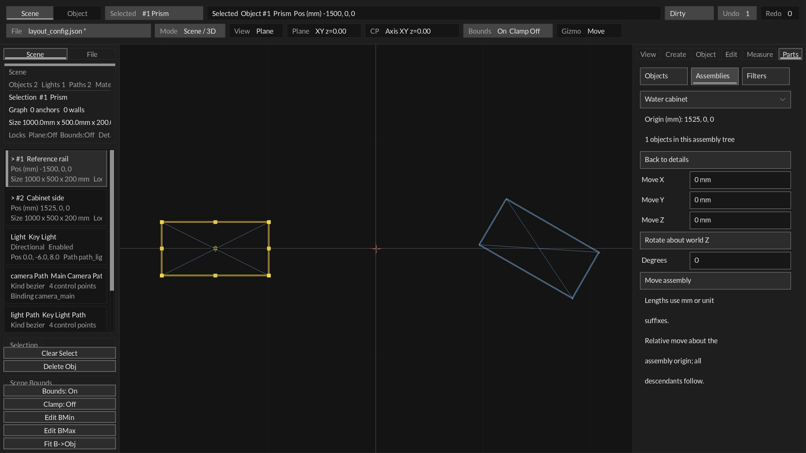

# Semantic parts and rigid assemblies (S2)

Status: bounded semantic organization and nested rigid assemblies implemented.
Date: 2026-09-29. S2 introduced schema 15; current schema 17 includes
[explicit relationships through Links](relationships.md) and
[reserved volumes and checks](spatial_checks.md). Program VERSION remains 0.4.0.

## Using semantic tools

Open an existing scene and choose **Object**. The selector below the tabs offers
Geometry, Details / tags, Assemblies, Connections, Volumes and Checks.
Visibility and saved filters are under **View → Visibility / saved views**. Each view has a name toggle and compact **Only** action.
Expand **Manage views** for undoable query removal. See [responsive panes](responsive_panes.md). The S2 workflow is below; the
[Links guide](relationships.md) describes S3a. Inputs have separate labels and inset fields;
selectors have arrows and actions have filled button faces. No new shortcuts are required.

1. In **Details / tags**, select a part in the viewport/list or the object selector.
   Enter a Name, choose a Type and Design/Reference role, and choose its Parent.
   **Apply details** commits these edits; **Reset details** restores saved details.
   A name is independent of the persistent ID shown below the form.
2. Open **Properties** to select/edit a property or enter a Key, value type and
   Value. **Set** stages it; **Apply details** saves it. Supported types are Text,
   Number, Boolean (`true`/`false`) and Length (`12.7 mm`, `0.5 m`, `3.5 in`).
   Bare lengths use the current display unit; stored length values are meters.
3. In **Assemblies**, use **New assembly**, enter a Name and optional Parent,
   then **Create assembly**. Its origin is the selected object's center, or world
   zero if no object is selected. Creating an assembly does not implicitly add
   that object. **Add selected: ...** explicitly adds the currently selected part.
   Alternatively, choose the assembly in the part's Parent selector. Child rows
   navigate to parts or nested assemblies. Reparenting preserves world pose.
4. Choose **Move / rotate assembly** for a separate movement form. Enter relative
   Move X/Y/Z lengths, click the world rotation axis to cycle X/Y/Z, enter Degrees
   and press **Move assembly**. Rotation is about the saved assembly origin;
   rotation precedes translation. Each angle is bounded to [-180, 180] degrees.
   All descendants move rigidly and one successful action adds one undo step.
   **Back to details** returns to metadata and members. Staged details must first
   be applied or reset. **Delete empty assembly...** requires confirmation and
   refuses an assembly with children; detach/reparent them first.
5. In **View → Visibility**, choose Type, Role, Assembly and an optional Property/Equals,
   then **Apply filter**. Criteria combine with AND; an empty Equals matches any
   value for that key. Assembly matches a subtree. **Show all** clears the query.
   Type/text values are case-sensitive exact matches; numeric equality uses a
   finite scalar, Boolean uses true/false, and length comparisons use meters.

The Role button cycles Design/Reference (plus All in Filters). Type permits custom
text. An assembly's type is Assembly; reference status and properties are not
inherited by its children. Filtering affects objects, not lights/materials/paths.
Selectors still offer filtered objects so they can be edited and recovered.

[Object properties capture](assets/s2-parts-object.png) and
[Design-only filter capture](assets/s2-parts-filter.png) show the same disposable
fixture. These are native rendered forms, not measured van geometry.

## Document and identity contract

Existing `coreMeta.object_id` stays authoritative. Names, types and parent IDs
are separate data. IDs survive rename, movement, reparent, undo and reopen.
Generated assembly IDs use a monotonic `assembly_N` sequence and avoid both live
and deleted object IDs. Assembly IDs must be unique across the whole store.

Schema 15 adds required `engineering` with `nextAssemblyId`, `entities` and
`assemblies`. Each live geometry entity has exactly one semantic record containing
`id`, `name`, `type`, `parent`, `reference` and `properties`. An assembly has those
fields plus `worldFrame`: origin XYZ then orthonormal U/V/N axes (12 numbers).
Property records carry `key`, numeric kind (Text 0, Number 1, Boolean 2, Length 3)
and a typed `value`. Empty type means PhysicalObject. Property keys allow letters,
numbers, underscore, dot and hyphen. Duplicate keys, nonfinite numbers, invalid
parents, cycles, malformed frames, missing/duplicate records and exceeded bounds
are rejected before replacing the document.

This slice supports **32 assemblies** and **8 properties per entity**, with 63-byte
IDs/types, 95-byte names, 47-byte keys and 127-byte text values (UTF-8 byte limits).
These are explicit initial storage bounds, not promises of unlimited metadata.
Schemas 0–14 load with empty/default semantics. Default-only engineering blocks
on a downgraded old-schema document remain readable; meaningful S2 data mislabeled
as an older schema is refused rather than dropped. Older readers reject schema 15.

## Transforms, validation and undo

Existing world geometry remains authoritative. Assemblies add world rigid frames;
`Layout_EntityLocalFrame` derives the frame relative to the direct parent. Origins
use the document's stored coordinate units; axes are unit vectors. Physical edit
translation is in meters and converts explicitly through metersPerWorldUnit.
Display units do not change geometry. Editing a child independently changes its
derived local pose. There is no second local geometry store and no assembly scale.

`Layout_SetEntityInfo`, `Layout_EditAssembly` and `Layout_MoveAssembly` use the
existing candidate/validate/history/publish transaction. Parent cycles, locked
members, bounds/plane conflicts, invalid metadata and history reservation failure
leave the scene and undo count unchanged. External constraint dependents may follow
a moving group, but a rule that changes a requested rigid member pose refuses the
whole move. Intermediate bounds checks can conservatively refuse a rotation even
if the final translated state would fit. Float geometry is not manufacturing proof.

Mesh world rotations compose their bases before converting back to Euler angles;
adding Euler components would distort an already-rotated mesh's relative orientation.
Primitive plane/prism frames and the existing fixed/travel/hinge rules remain in use.
The assembly selector is a metadata/group-edit target, separate from the current
viewport object selection. Individual gizmos continue to edit individual objects;
this slice has numerical assembly movement, not assembly drag handles.

## Queries, rendering and export

`Layout_QueryEntities` lists matching objects and assemblies by stable ID, returning
the full match count even when an output buffer is smaller. `Layout_QueryMatches`
checks one entity. Filters are a transient session query, separate from authored
visibility. They survive undo/reload within a session, do not create undo entries
or mark the document dirty, and are not saved. **Show all** clears retained filters.
Filtered objects are omitted from wireframe/solid/mesh preview, list, hitboxes,
gizmos and measurement annotations. Validation still considers them.

Canonical scene objects carry `extensions.engineering`; assembly records remain
in `extensions.line_drawing.layout_snapshot`. Runtime compilation preserves these
extensions. Existing render geometry stays flattened in world space. Filters never
remove entities from saved layouts or export. A consumer must resolve the semantic
extension/snapshot deliberately; no renderer hierarchy contract was replaced.

Mesh-asset authoring save and whole-layout ObjectAuthoring replacement refuse a
scene with S2 engineering data, avoiding silent metadata/hierarchy loss. This is a
bounded guard, not an engineering-aware mesh editing round-trip implementation.

## Evidence and remaining boundary

451 host tests / 44 reported suites pass, including 9 Engineering tests and the
33 existing Constraints tests. New regressions cover typed metadata, stable IDs,
queries, actual SDL mouse actions, nested rigid movement, mesh frame preservation,
reparent, history refusal, lock/bounds/rule conflicts, malformed loads, older schema
compatibility, transient filtering and semantic authoring/runtime export.
Producer smoke, shape tool build and Main Edit package self-test pass. Native
Objects/Assemblies/Filters captures were inspected. Human acceptance of this new
Object → Details is still separate from those automated/rendered checks.

S2 here means the bounded semantic organization and assembly foundation. Types
such as Panel/StructuralMember/KeepoutVolume label existing geometry; assigning
these types does not create a new primitive, impose clearance or calculate loads.
Relationship edges now ship in S3a. Remaining exclusions include saved query collections, inherited properties,
assembly scaling, group viewport handles, constraint solver for arbitrary meshes,
collision/service checks, cable routing or MCP transport additions in this slice.

S3A relationships and [S3B/S3C reserved volumes/checks](spatial_checks.md) are
implemented. Next: S4 sampled motion and conservative envelopes. New panel/beam
creation presets can then make those workflows easier. Sampled movement/envelopes
remain S4; compiler/telemetry bindings remain later phases.

## Saved assembly movement (2026-10-04)

Parts offers **Move saved motion** for assemblies with a saved Travel/Hinge.
Selecting a descendant object and opening Measure discovers the same movement.
The panel identifies the assembly that moves; it does not author a second motion
for the selected child. The existing solver, bounds, validation and undo remain
responsible for applying the motion.
