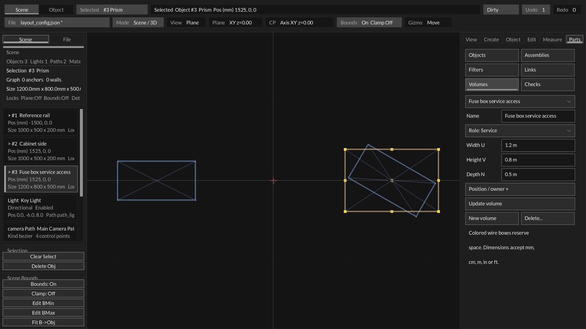
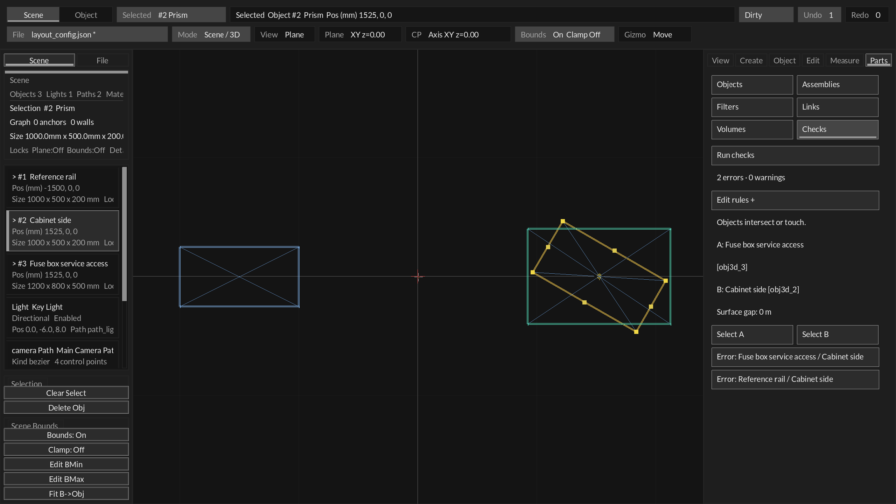

# Reserved space and spatial checks (S3B/S3C)

Implemented 2026-09-30. Current layout schema **17**. Program VERSION remains 0.4.0.
This is the bounded first volume/intersection/clearance slice, built on S1 mechanical
layout and S2/S3A identities, assemblies and relationships.

## Visible workflow

Use **Parts → Volumes** to create a box representing Keep-out or Service space.
Enter a Name, choose its Role and enter Width U, Height V and Depth N. Dimensions
accept mm, cm, m, in or ft; bare numbers use the current display unit. New boxes
start axis-aligned at world zero. **Position / owner +** exposes world X/Y/Z and an
optional owner selector. **Create volume** saves the staged fields in one undo step.
Use the saved-volume selector to edit a box, **Update volume** to publish changes,
**New volume** to stage another, or **Delete...** and its confirmation to delete.

Volumes are existing prism entities with an explicit reserved-space role, not
solid furniture. Their ordinary stable object IDs, transform editing, assembly
parenting and filters remain available. Keep-out boxes render pink; Service boxes
render cyan; selection/hover retains the normal editor highlight. They remain wire
boxes in solid previews. The owner exemption is independent of transform parenting:
choosing an owner does not attach or move the volume. Parent both into an assembly
when they should move together. Editing dimensions preserves the box's rigid frame;
U/V/N dimensions follow its orientation while position fields remain world X/Y/Z.

Use **Parts → Checks → Run checks** to inspect the current document. Reserved
volumes automatically check all design objects, including hidden objects. Other
reserved volumes and Reference objects are excluded from these automatic checks.
The declared owner, or all descendants of a declared owner assembly, is exempt.
Reference geometry can still participate in an explicitly saved pair rule.

**Edit rules +** exposes A, check kind, B and (for Minimum clearance) a physical
Minimum field. **Create check / Update check**, **New check** and confirmed
**Remove...** are explicit actions. Objects and assemblies can be endpoints.
Assembly endpoints expand to their descendant objects; each distinct geometry
pair produces its own result. A check with no distinct geometry pairs is unresolved,
not a pass. Self and duplicate unordered pair/type checks are refused.

Click a result to see the affected names and stable IDs, measured surface/bounds
gap, required gap and diagnostic. **Select A / Select B** highlights an object in
the existing viewport. Results are marked stale and hidden after authored geometry,
metadata, hierarchy, owner or rule changes, including undo. Run checks again to
refresh them. View filtering and selection alone do not stale results.

Checks are read-only design diagnostics. Errors do not block exploratory geometry
edits, move objects or add driving constraints. Explicit Run keeps the UI response
predictable and avoids running a quadratic spatial scan on every mouse movement.

## Geometry and evidence limits

Prisms use their oriented authored frames, not a world AABB overlap alone. Panels
use their actual zero-thickness rectangular surface. Intersection uses separating
axes; separation uses closest vertex/face and finite edge/edge distances. The
reported gap is the shortest nonnegative distance between the tested geometric
sets, in meters. Intersection/contact returns zero; penetration depth is not
computed. Contact within 1 micrometer counts as intersection, and clearance has a
1 micrometer comparison tolerance. The existing float geometry's precision still
limits very large-coordinate layouts.

Imported meshes use conservative world bounds. Results are always **Warning**,
with `approximate=true`; they never claim triangle-level collision or clearance
acceptance. Unsupported or unavailable geometry also returns an unresolved warning.
Automatic reserved-space checks report obstructions/unresolved geometry rather
than emitting every clear pair. Explicit pair rules include passes.

No physical-fit validation is inferred from `contained_by` or attachment/support
links. Structural capacity, electrical safety, triangle collision, motion sweeps,
Boolean volumes, free-space search and a general constraint solver are outside this
slice. Service volumes are manually authored boxes, not automatically derived access
paths. Existing Travel/Hinge controls do not yet produce motion envelopes.

## Persistence and transactions

Schema 17 adds per-entity `volumeRole` (0 none, 1 Keep-out, 2 Service) and
`volumeOwner`, plus `engineering.spatialChecks` and `nextSpatialCheckId`.
Checks have monotonic `spatial_N` IDs, stable source/target IDs, type
`must_not_intersect` or `minimum_clearance`, and canonical `clearanceMeters`.
A scene supports up to 32 saved pair checks. Volume count uses the existing object
store rather than a separate namespace. Reserved volumes require design prisms
with positive depth; invalid roles, owners or reference designation are rejected.

Schemas 0–16 migrate with no reserved roles or pair checks. Nonempty spatial data
mislabeled as an older schema is refused. Schema 17 requires the spatial fields;
malformed loads fail before replacing the active document. Edits use the existing
candidate-validation-history-publish path. The candidate transaction now supports
append-only object creation; allocation or history failure leaves the original
store, IDs and geometry intact. Deletion remains a tombstone. Linked/check endpoints
and volume owners cannot be deleted until their references are explicitly removed.

Canonical authoring/runtime exports retain the full schema-17 layout snapshot,
including volumes and rules. Reserved boxes are omitted from physical renderer
objects and physical camera framing: empty access space is not rendered as solid
material. Their annotations remain in the authoritative snapshot for consumers
that understand them. This uses the existing core_scene/core_scene_compile
extension transport; shared library APIs/versions and renderer formats are unchanged.

## Structured access

`Layout_EditVolume`, `Layout_EditSpatialRule`, `Layout_CheckSpatial` and
`Layout_SpatialDistance` expose typed operations. `Layout_CheckSpatial` returns the
full result count even if an output buffer is smaller. `Layout_SpatialReportJson`
returns a caller-owned `line_drawing_spatial_report_v1` JSON report with IDs,
severity, measurable/approximate flags, intersection, measured/required meters and
messages. The UI displays the first 256 results and explicitly reports truncation;
JSON reports cap at 4096, retaining full `total` and `truncated` fields. Refine the
scene/rules or use the typed API for a larger result buffer.

The existing headless tool provides a read-only report without creating output
folders or writing the document:

```sh
make agent_scene_tool
build/toolchains/clang/bin/agent_scene_tool --check-layout /absolute/path/layout.json
```

Exit 0 means a report was produced, including design errors. Load/report failure
returns 1; invalid arguments return 2. Consumers must inspect result severity and
`truncated`; exit status is not a design-acceptance signal. No live MCP edit
transport or automatic design acceptance is introduced here.

## Verification and next boundary

Regression evidence covers transaction/history failure, numerical diagonal gaps,
contact, rotated bars with overlapping AABBs, panel distances, physical world scale,
mesh warnings, unavailable geometry, owner assembly exemptions and rigid movement,
visibility independence, rule capacity, schema migration/malformed loads, runtime
snapshot preservation, and mouse-driven create/edit/remove/check/undo/stale workflows.
Source-run native fixtures cover Volumes, Checks and the expanded rule form. These
are disposable fixtures and do not replace the user's saved scene.




Next is S4 sampled motion and conservative envelopes, reusing these reserved-space
and check contracts. Triangle-level mesh checks and richer service-volume derivation
remain follow-on work. User acceptance of the new UI remains separate from tests
and rendered/package proof.
