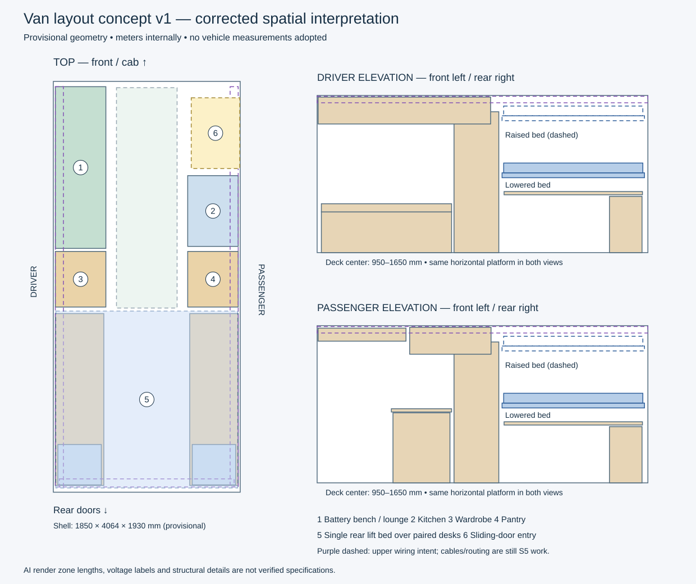

# Van layout concept v1

**Superseded furniture layout:** use [narrow v2](van_layout_narrow_v2.md) for the
user-corrected bed width and section flow. This v1 remains a historical snapshot.


Date: 2026-10-04. Status: editable concept; no measured vehicle geometry adopted.
This is a new project alongside the illustrative teaching van, not a replacement
for `van_working.layout.json`. The three supplied AI images establish arrangement
intent. They are not calibrated drawings, OEM specifications or fabrication plans.
Source filenames and SHA256 fingerprints are recorded in
`config/concepts/van_layout_v1.references.json`.



## Intent and corrected interpretation

The driver side carries the forward battery/electrical bench and lounge, opposite
the passenger sliding door. The passenger kitchen starts behind that door. Tall
wardrobe/storage is on the driver side and pantry/tools on the passenger side,
ahead of the rear work area. Two rear desks face the sidewalls, leaving the middle
for chairs/access when the bed is raised.

There is **one horizontal rear bed**, spanning the width over both desks. It moves
vertically as one assembly with mattress and moving rails. The bed is not an
upright wall panel, not two independent beds, and not a folding wall bed. This is
the initial interpretation pending the user's confirmation of the mechanism.
Fixed lift guides are a separate assembly and stay fixed. Guide mounting, lift
synchronization, load capacity and retention are not designed here.

A named upper low-voltage routing intent runs along both roof edges with a rear
cross-link and a driver-side riser down to the electrical bay. It is represented
by labeled reference regions. These are not cables, calculated wire lengths,
electrical connections, or implemented S5 routing corridors. Front roof crossing
and branch destinations are deliberately undecided. A future loop or trunk with
branches must be decided from topology; a physical corridor does not assert a CAN
bus ring or electrical topology.

Driver-side overhead cabinets stop before the bed's swept footprint. Passenger
cabinets also stop before the sliding doorway; a shallow, higher header storage
block represents the step over the entry. The wire region continues above the
stowed bed. This avoids forcing the renders' deep continuous cabinets through
bed travel or entry headroom.

## Explicit frame

World geometry uses meters and the existing right-handed Z-up contract:

- Origin: cargo floor center, on the finished-floor reference plane Z=0.
- +X: passenger / sliding-door side; -X: driver side.
- +Y: forward toward the cab; -Y: rear doors.
- +Z: upward. Display units may be mm without changing geometry.

The review top view puts the cab at the top and driver side on the left. Both
side elevations put front at the left and rear at the right. Identical entity IDs
refer to the same object in every view; no image mirroring sets object placement.
The rear opening reference is initially hidden to aid inspection. The passenger
wall is split to leave a provisional sliding-door gap.

## Dimension basis

No dimension below is measured or approved for construction. Every authored part
has `dimensions_status=concept_not_measured`. The 4064 mm floor length and 1930 mm
height are rounded concept values inspired by the image labels; 1850 mm full
width is carried from the previous teaching model. The images' approximately
56-inch dimension is **between wheel wells**, not a full interior-width claim.
It is not used to scale the whole room. The wheel-well placeholders here leave
1050 mm between their inboard faces, so that gap remains explicitly unverified
and does not reproduce the image's 56-inch label.

The four longitudinal image zones sum to 4064 mm, but the rear 1016 mm zone is
inconsistent with the pictured lift bed and paired desks. Instead of accepting
that contradiction, the concept gives the bed a 1750 mm fore/aft footprint and
compresses the kitchen/storage allocation. These choices expose the space budget
for review; they are not a final interpretation of those zone lengths.

| Component | Provisional size (X × Y × Z, mm) | Placement / meaning |
|---|---:|---|
| Interior reference | 1850 × 4064 × 1930 | Flat box approximation, not van curvature |
| Bed deck | 1800 × 1750 × 60 | Center (0, -1115, 950); moves in Z |
| Mattress | 1760 × 1710 × 120 | Center 90 mm above deck; unspecified actual mattress |
| Each rear worktop | 480 × 1700 × 40 | Centers X=±665, Y=-1115; top Z=750 |
| Driver bench enclosure | 500 × 1600 × 500 | Center (-655, 1180, 250) |
| Passenger kitchen enclosure | 500 × 700 × 860 | Center (655, 750, 430) |
| Each tall storage block | 500 × 550 × 1730 | Centers X=±655, Y=75 |
| Main aisle reservation | 600 × 2180 × 1700 | Front/middle aisle only |
| Side upper wire region | 80 × 3960 × 80 | Centers X=±865, Z=1880 |

The transverse 1800 mm deck dimension may be too short for the intended sleeper.
Measure the required sleeping length before locking bed orientation or adding
wall flares. Kitchen length and desk chair space likewise require ergonomic
review. The bed range is **deck-center Z=950–1650 mm**; at the top pose the mattress
top is approximately 1800 mm, leaving only 130 mm to the provisional ceiling.
The moving rails underside is approximately 870 mm at the lower pose, above the
750 mm desk surface. These are geometric gaps, not comfort or safety approvals.

## Electrical and water basis

The user confirmed driver-side battery/electrical placement and upper wire-run
intent. Battery/inverter/distribution/hub shapes are packaging placeholders.
The prior conversation's 24 V direction is carried as `provisional_24V`, with
capacity undecided and pending explicit confirmation. The images' 12 V / 300 Ah
label is not adopted. No battery chemistry, module count, protection design,
wire gauge, mains design or purchasing recommendation is set by this concept.

Water tank/pump/controller sit under the passenger kitchen for this first layout.
Tank capacity, potable/grey locations, plumbing penetrations and appliance sizes
remain undecided. CAN0 is a candidate network tag on the hub/controller, not an
implemented scene connection. A cooktop is an optional reference footprint.
Fold-out table/counter leaves are deferred until their size, hinge and required
clearances are agreed; their rendered forms are not silently made authoritative.

## Scene contract and present proof

The prepared document has 50 objects (including the native bed envelope), 10
assemblies, one saved bed travel rule, four containment relationships and 12
explicit bed-range no-intersection checks. The checks cover both desks, drawer
blocks, tall storage, overhead cabinetry and upper wire regions. The native
finalizer generates the conservative envelope and tests min/max on an isolated
reloaded candidate. All 12 saved checks pass for these simplified boxes.

That result concerns these provisional primitives. It does not validate physical
fit, people, OEM rib locations, wheel-well accuracy, guide installation, load
paths, or actual wire/pipe routing. Fixed guides have millimeter-scale lateral
gaps to the deck; exact guide/bed hardware dimensions are a required next pass.

Main aisle, entry space, electrical service strip and rear floor threshold have
reserved-space roles. Chair spaces are **conditional reference markers** labeled
`condition=bed_raised_only`, not always-active service rules. The validator does
not yet express occupant/motion-state conditions. Rear threshold clearance also
does not promise full standing access through rear doors with the raised bed.
The automatic reserved-space report shows no conflicts in this concept.

Cabinet, bench, battery, appliance and tank boxes describe packaging extents.
They are not detailed solid panels, hollow tank wall geometry, or solver-ready
material assemblies. There are no intentionally obstructing teaching objects in
this design. Physical attachments to OEM structure remain undecided; containment
records do not imply structural mounting. Materials and loads remain unset.

## Authoring and regeneration

Authoritative authoring input: `config/concepts/van_layout_v1.json`. The native
editable starting scene is `config/examples/van_layout_concept_v1.layout.json`.
After loading it, save your manual changes as a new working file. Regeneration
only publishes into a new directory and refuses existing outputs.

```sh
make van_concept_tool
python3 tools/build_van_concept.py --out tmp/van_concept_review_02
make van-concept-smoke
python3 tools/van_concept_views.py config/concepts/van_layout_v1.json docs/assets/van-concept-v1.svg
```

The output directory contains the copied concept request, editable layout,
`scene_authoring.json`, compiled `scene_runtime.json`, and `validation.json`.
Edit the request or an editor working copy; never manually edit compiled runtime.
The dedicated input schema is app-specific authoring data, not an extension to the
ordinary agent request format. The helper reuses existing layout/units, motion,
scene export and shared core_scene_compile; no shared ABI or Desktop UI changed.
Native scene/schema loading is the current bridge. PhysicsSim and RayTracing
workloads were not run or claimed as validated for this concept.

## Next refinement sequence

1. Confirm bed mechanism, sleeping dimensions and electrical basis. Agree the
   core arrangement before modeling decorative cabinets or fixtures.
2. Measure the actual cargo floor, width at floor/desk/bed/roof, floor-to-roof
   height, door openings, wheel wells and selected OEM attachment features. Keep
   source, unit, measuring points and uncertainty with each verified value.
3. Replace shell references and bed/guide hardware extents while retaining IDs.
   Set mattress, desk/seat ergonomics and lower/upper bed stops. Regenerate the
   envelope and repeat obstruction/service checks after each dimensional edit.
4. Implement [S5A physical routes](s5_routing_plan.md) against this arrangement:
   driver hub → upper riser → roof corridor → passenger water-controller branch.
   Start with editable waypoints and length; then corridors and obstruction checks.
5. Route power and plumbing once equipment specifications/topology are known.
   Separate mains/power/data/wet-space intent through metadata and appropriate
   clearances; do not infer separation requirements from the pictures.

## Desktop review handoff

A create-only copy was placed beside the original van files in the Main Edit
`projects/van_workflow` folder. In the installed Desktop app it loaded as Saved
with 50 objects and Undo 0. Selecting **#10 Bed deck** and choosing **Measure**
automatically discovered `bed_lift`. **Max** moved the deck 950 → 1650 mm,
mattress 1040 → 1740 mm, and moving rails 910 → 1610 mm; the fixed guide stayed
at 1200 mm. **Undo** restored 950/1040/910, Saved and the selected bed. No test
pose was saved. The concept is left open on those controls.

Use **Max**, **Min** or the slider to inspect the arrangement, and **Undo** to
return to the saved state. Use **View → Visibility** to inspect an individual
assembly or reference/design role when the full wireframe is crowded. Save a
working copy before making persistent layout changes. `van_working.layout.json`
was not overwritten or changed by the concept handoff.
